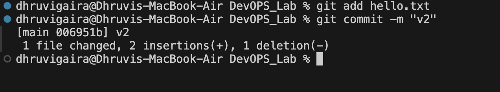
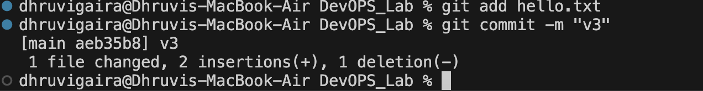
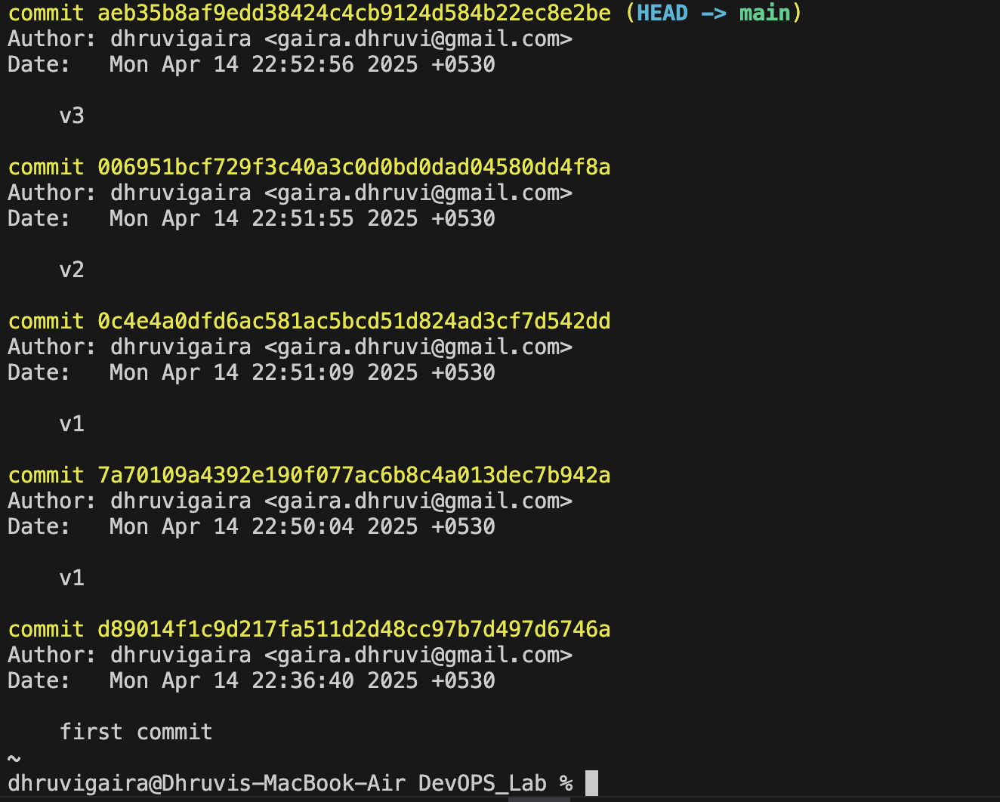
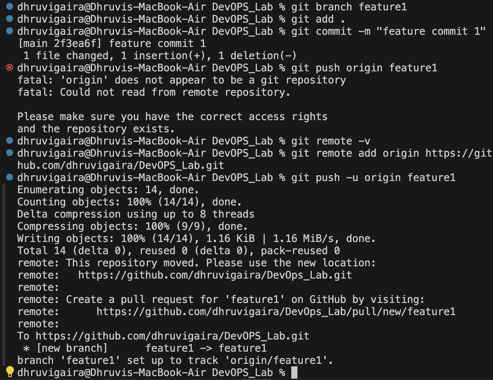
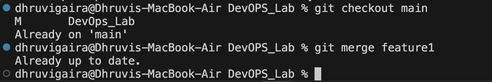

# DevOps_Lab
# devops_lab
# DEVOPS LAB
## LAB-1 GIT COMMANDS

### 1. Clone the repository:
⁠ ```sh
git clone https://github.com/shlokiii/devops_lab.git
 ⁠⁠ ```


### 2. Adding image:
⁠⁠ ``` sh 
git add .
git commit -m "my first commit with image"
git push
 ⁠⁠ ```


### 3. Git status and Diff Commands:
⁠⁠ ``` sh 
git staus
 ⁠⁠ ```

⁠ ```
⁠ sh
git diff
 ⁠⁠ ```


## LAB-2 GIT COMMANDS
### 1. Checking the logs
### version1:
```⁠ sh
git add hello.txt
git commit -m "v1"      
 ```


### version2:
```⁠ sh
git add hello.txt
git commit -m "v2"      
 ⁠```


### version3:
```⁠ sh
git add hello.txt
git commit -m "v3"      
 ⁠```


⁠ ```sh
git log
 ⁠```



### 2. Creating branch and merging with Main
```⁠ sh
git branch feature1
git add .
git commit -m "feature commit 1"
git push origin feature1
 ⁠```


### Merged with Main
⁠ ```sh
git add README.md
git commit -m "Updated README before merging"


git checkout main
git merge feature1 -m "Merging feature1"
 ⁠```


