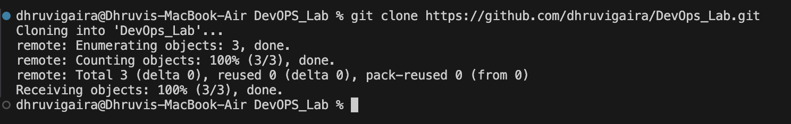
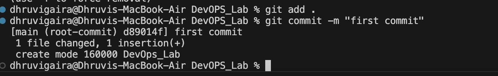
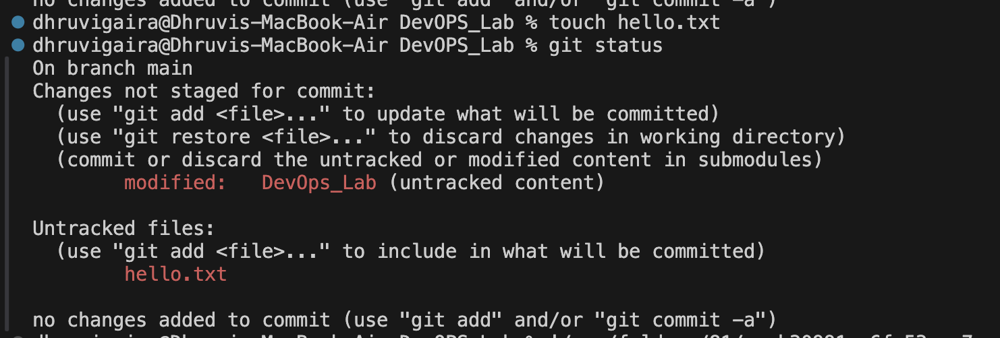
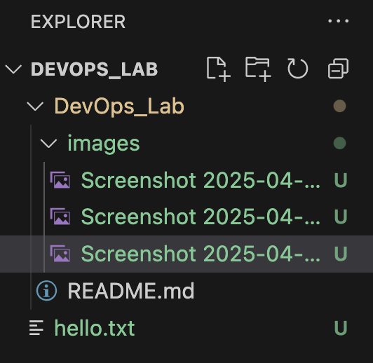

# DevOps_Lab
# devops_lab
# DEVOPS LAB
## LAB-1 GIT COMMANDS

### 1. Clone the repository:
⁠ ```sh
git clone https://github.com/shlokiii/devops_lab.git
 ⁠⁠ ```



### 2. Adding image:
⁠ sh 
git add .
git commit -m "my first commit with image"
git push
 ⁠



### 3. Git status and Diff Commands:
⁠ sh 
git staus
 ⁠


⁠ sh
git diff
 ⁠


